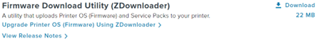
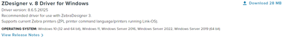
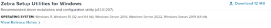
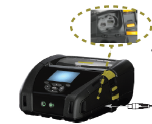
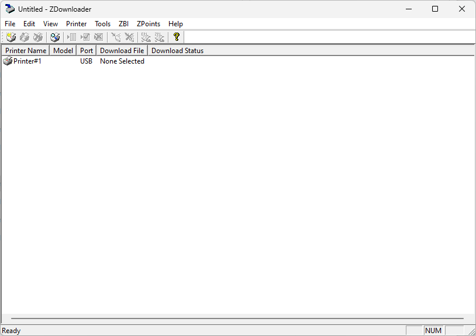
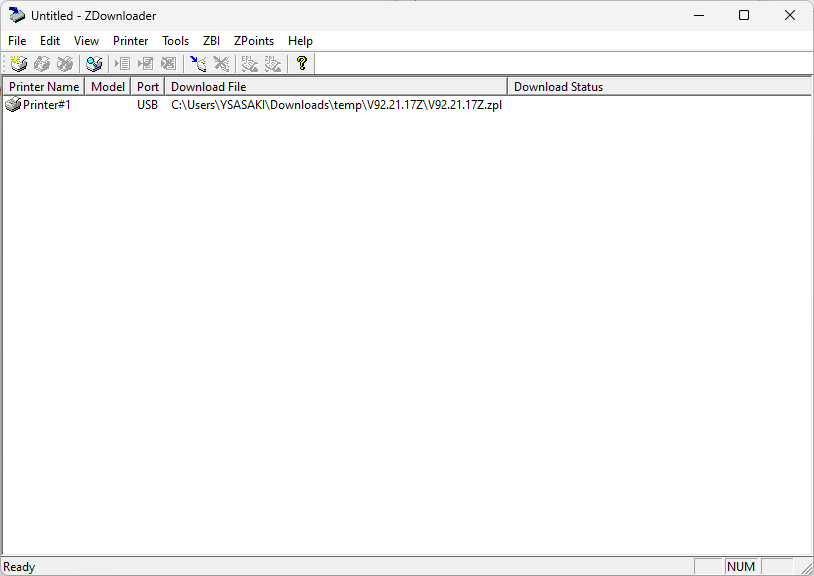
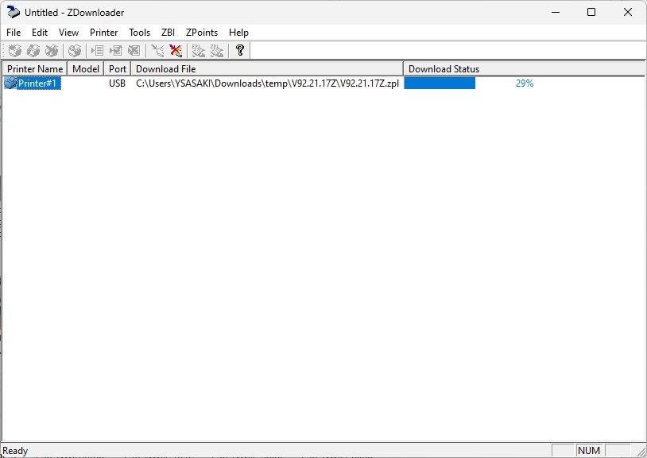
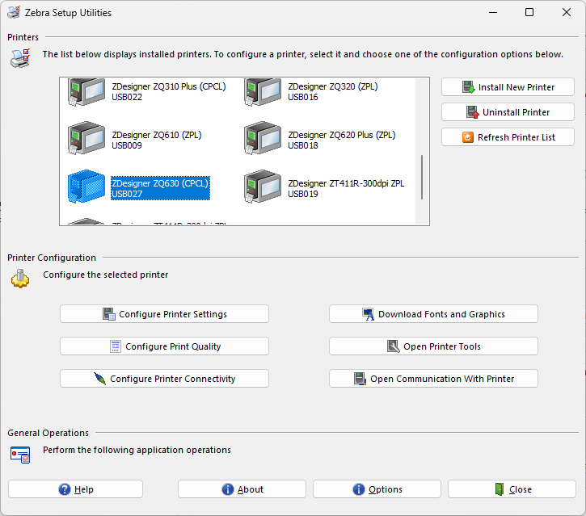
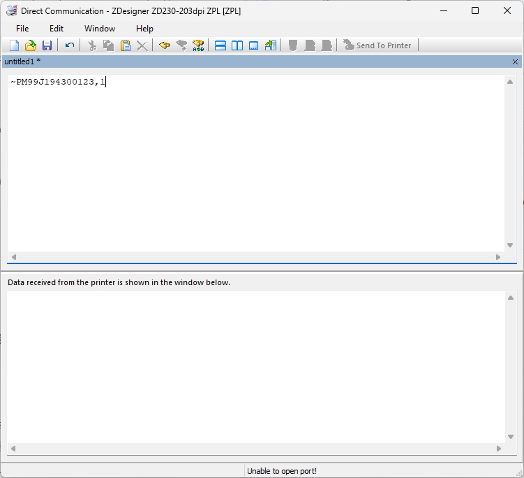

# Zebra-Printer-How to Completely Wipe Data and Factory Install Link-OS Priner
 Link-OS 5.2以上のプリンタを完全初期化する方法

 
 

本手順書は2023/06/20時点の情報を基に構成されたプリンタを工場出荷状態に戻す手順書となります。下記につきましては記載をしていませんので、個々の手順書、もしくは、ユーザーズ・ガイドを参照ください。

 
 

- 日本語フォント、画像、テンプレートのインストール
- 印刷に関する設定（印字速度、濃度、センサー設定、位置調整 など）
- プリンタ画面表示設定（表示言語、設定ロック など）
- Wi-FiやEthernetの接続設定
- その他、プリンタ制御設定 など

  

# ▢ 用意するもの

本手順では下記のマテリアルが必要となります。

1. セットアップ用のWindows パソコン (Windows 10以上を推奨)
1. Link-OS プリンタ（Link-OS v5.2以上）
1. USBケーブル(上記パソコンとプリンタ接続用)

  

# ▢ 手順

 

## パソコン操作
    
 

1. ZDownloader のダウンロードとインストール 

    ZDownloader をダウンロードし、インストールします。   
    ※ www.zebra.com の製品サポートページからダウンロードください。

       
    ▲ [Printer OS] > [Firmware Download Utility (ZDownloader)]

     

1. Windows ドライバのダウンロードとインストール

    ドライバをダウンロードし、インストールします。  
    ※ www.zebra.com の製品サポートページからダウンロードください。

       

    ▲ [Drivers] > [Windows Printer Driver v8] 

     

1. Zebra Setup Utilities for Windowsのダウンロードとインストール

    Zebra Setup Utilities （以降ZSU）をダウンロードし、インストールします。  
    ※ www.zebra.com の製品サポートページからダウンロードください。

       
    ▲ [Drivers] > [Zebra Printer Setup Utilities] 
    
     

1. Firmwareのダウンロード 

    最新のFirmwareをダウンロードし、任意のフォルダで解凍します。  
    ※ www.zebra.com の製品サポートページからダウンロードください。
 
    ▲ [Printer OS] > [Printer OS Vxx.xx.xxZ*]   
      \* 最新版をダウンロードください
      
     
     

## プリンタ操作
    
 

1. PCとプリンタを USBケーブルで接続します。  

      
    ▲ 例、ZQ600の場合

     

1. プリンタにラベルをセットします。

1. プリンタの電源をONにします。  

    

  

## パソコン操作 (ZDownloader)
    
 

1. ZDownloaderを起動します。*  
    \* Windows ボタン → "firmwareDownloader"で検索

1. ZDownloaderの空白エリアを右クリック→ [Auto-Detect Printers]を選択します。

1. しばらくすると接続されたプリンタが表示されます。

    

     

1. プリンタアイコンを右クリック→ [Select Firmware Files] → "Vxx.xx.xxZ.zpl" *を選択します。
    \ * 手順「Firmwareのダウンロード」で．解凍したフォルダ内に含まれています。

    

     

1. 対象プリンタアイコンを右クリック→ [Download to Selected]

1.	ファームウェアの更新処理が開始されます。
    

     

1. ファームウェアの更新処理が完了するとプリンタが再起動し、設定ラベルが印刷されます。  

        ラベルによっては"Media-Out"が発生しますが問題はありません。気になる場合はユーザーズ・ガイドを参考に用紙に合わせた用紙設定を実施し、用紙のキャリブレーションを行ってください。

1. ZDownloaderを閉じます。

      

## パソコン操作 (Zebra Setup Utilities for Windows)
    
   

    ※ 本手順書はZebra Setup Utilities for Windows(以降ZSU)の言語設定が「英語」になっていることが前提となります。本手順書とソフト内の言語が異なる場合は下記操作に従い言語設定を変更ください。
     
    ▶ 言語設定方法
        a. ZSU を起動。
        b. [オプション] を選択。
        c. [言語] > "English" に変更。
        d. [OK] を選択。
        d. ZSU を再起動し、言語が「英語」になっていることを確認。
    
   

1. Zebra Setup Utilities for Windows (以降ZSU) を起動します。

1. 画面上部ペイン（Printers)から接続対象のプリンタを選択します。
      
    ▲ 例）例、ZQ630が選択されている状態
    
       

        ※ 対象のプリンタが表示されない場合は下記をお試しください。  
        a. [Refresh Printer List] を選択し、プリンタリストを更新します。
        b. USBケーブルを再接続します。
        c. パソコンとプリンタを再起動します。
         
        上記、実施にも関わらず表示がされな場合はご利用PCの環境をご確認の上、[Install New Printer] にて手動にてプリンタのドライバ登録を実施ください。

    
       

1. 画面中央ペイン（Printer Configuration)から[Open Communication with Printer] を選択します。

1. 上部ペインに下記コマンドを入力します。

        ~PM[プリンタのシリアル番号*],0 [Enter**]
        * シリアル番号はプリンタ添付のラベルに記載があります。
        ** Enterキーは必ず入れてください。

        入力例、シリアル番号が99J194300123の場合、
        ~PM99J194300123,0 [Enter]

       

    
       

1. [Send to Printer] を選択します。
    ※処理に5-10分ほどかかります。

1. プリンタが再起動します。

1. 設定が初期化されていることを確認します。
    
        例）格納されているファイル一覧を表示。
        自社で格納したファイルがなくなっていることを確認すること。

        ! U1 do "file.dir" "E"

1. ZSUを終了します。

       

# ▢ 手順完了
 

